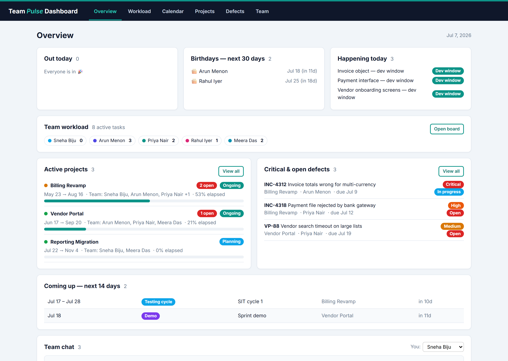
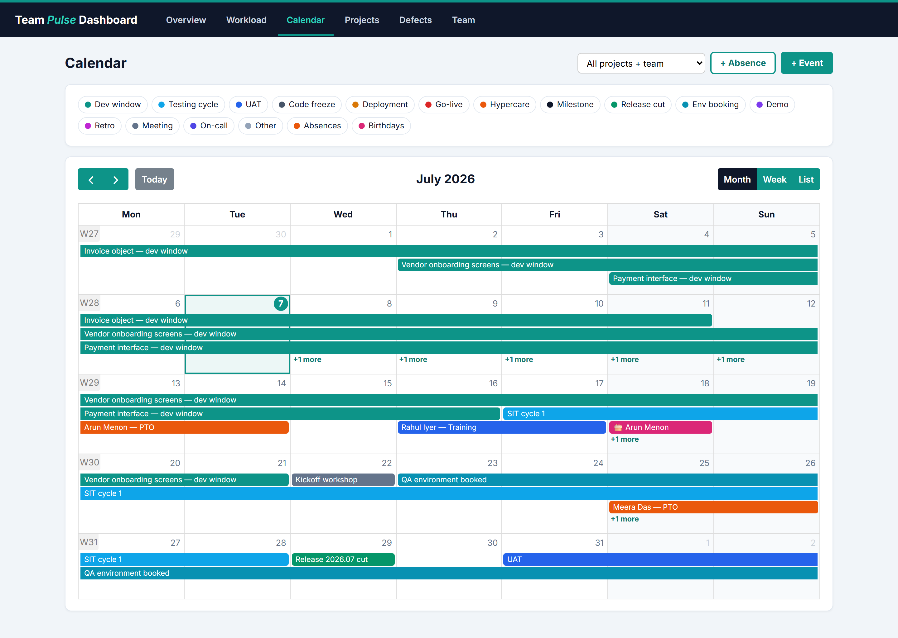
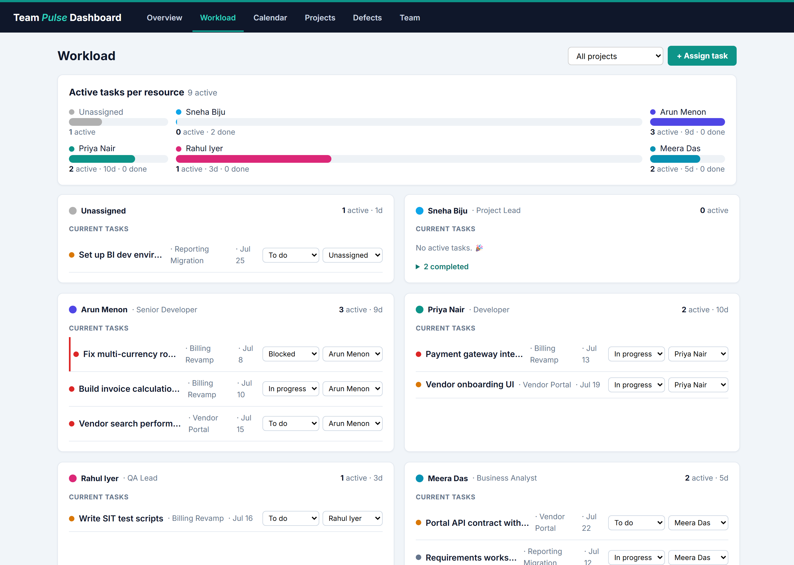
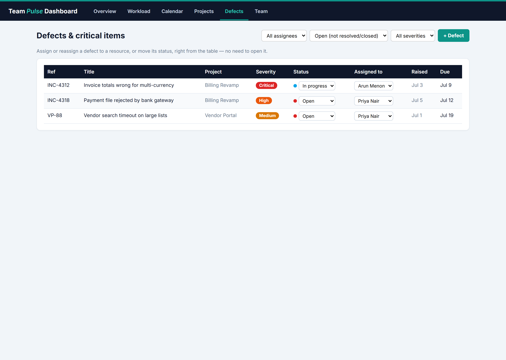
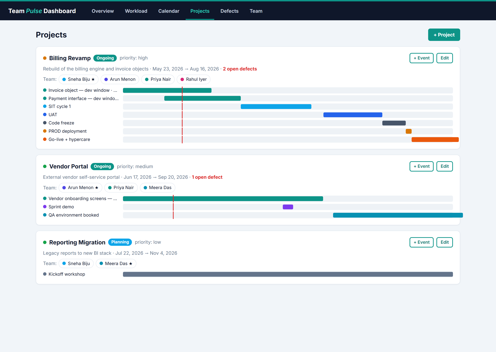
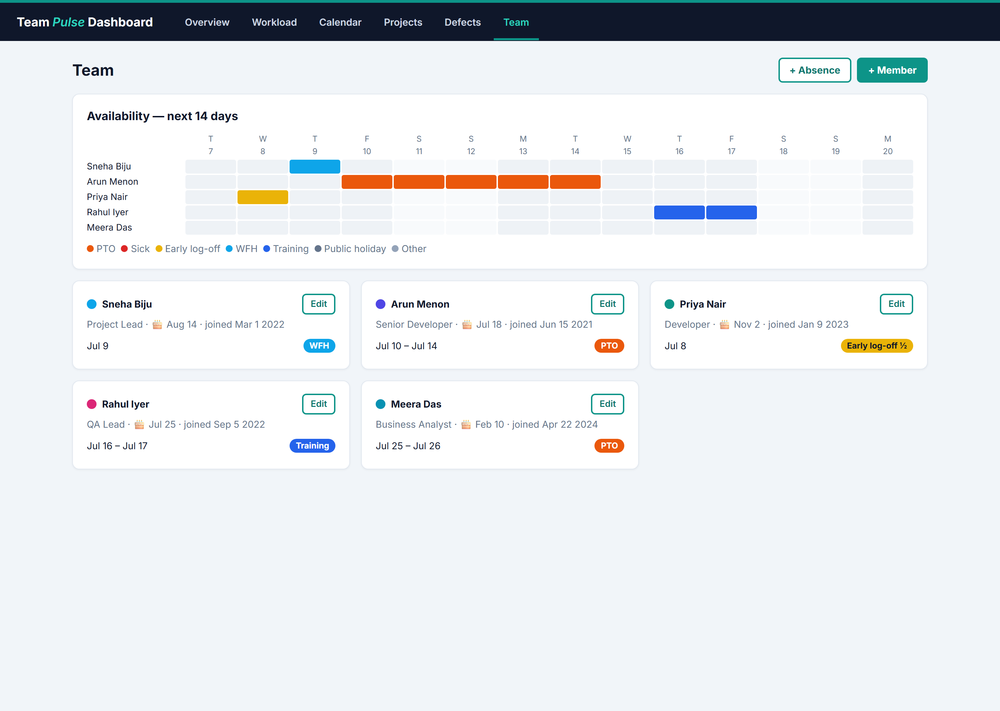

# Team Pulse Dashboard

An interactive delivery dashboard for a software project team - timelines,
workload, availability, and defects in one place, all editable in the app.


> **Live demo:** _https://team-pulse-dashboard.onrender.com_ (see [Run it on the web](#run-it-on-the-web)).
> It ships with realistic sample data and seeds itself on first launch, so the
> dashboard is fully populated the moment it opens.

## What it solves

Delivery-relevant information for a project team is usually scattered across a
Gantt chart, a spreadsheet of leave, a defect tracker, and chat. **Team Pulse**
pulls the views a delivery team actually looks at day-to-day into one
calendar-first dashboard: what's shipping and when, who's working on what, who's
out, and which defects are on fire — with everything editable inline and stored
locally, so there's nothing to integrate to try it.

## Screenshots

### Overview — the daily pulse


### Calendar — every delivery event, colour-coded and filterable


### Workload — organised by resource, with inline reassignment


### Defects — assign and track open items inline


<details>
<summary>More views — Projects &amp; Team</summary>

<br/>

**Projects** — status, resources, and a mini-Gantt per project


**Team** — 14-day availability strip and per-person cards


</details>

## Features

- **Calendar** — month / week / list views of every delivery event type (dev
  windows per object, testing, UAT, code freeze, deployment, go-live,
  hypercare, release cuts, environment bookings, demos, milestones…) plus team
  absences and birthdays. Colour-coded, filterable by category and project,
  click to edit, drag across days to create, with today clearly highlighted.
- **Workload (by resource)** — one card per person showing their current tasks
  and completed work, with a comparative active-load bar chart. Reassign a task
  to another resource or change its status from a dropdown; assign new work to
  anyone; an "Unassigned" bucket surfaces unowned tasks.
- **Projects** — status / health / priority, the resources working on each
  project (lead marked ★), and a mini-Gantt of the project's timeline with a
  live "today" marker.
- **Defects** — an open-defect register you can filter by assignee, status, or
  severity, and **assign or reassign to a resource inline** without leaving the
  table. Overdue items are flagged.
- **Team** — a 14-day availability strip (who's out, when) and per-person cards
  with roles, birthdays, and upcoming leave.
- **Overview** — who's out today, birthdays in the next 30 days, active windows,
  a team-workload snapshot, project health, critical defects, the next 14 days,
  and a **team chat with @mentions** for daily updates.

All data is editable in-app and persisted in a local SQLite file — no external
services required to run it.

## Tech stack

| Layer | Choices |
|-------|---------|
| Frontend | React 18, Vite 6, FullCalendar 6, hand-rolled CSS design tokens |
| Backend | FastAPI, SQLAlchemy 2.0 (typed models), Pydantic v2, SQLite |
| Delivery | Docker (multi-stage), Uvicorn, single-process hosting |

## Architecture & design decisions

The parts I'd point a reviewer to:

- **Single-process deployment.** FastAPI serves the built React SPA *and* the
  JSON API from one process/origin. In production there's no CORS to manage,
  one URL to host, and the multi-stage `Dockerfile` produces a single image —
  `docker run` and you're live.
- **DRY where it helps, explicit where it matters.** Four of the five entities
  share a generic CRUD router factory; projects and chat get dedicated routers
  because their behaviour differs (a many-to-many resource list, server-set
  timestamps, mention handling) — abstraction only where it pays off.
- **Modelled domain.** Projects ↔ members is a real many-to-many (resources);
  tasks carry status / priority / estimate / completion date; defects, absences,
  timeline events and chat messages each have their own typed model. The
  resource-first workload view is derived on the client from a single data load.
- **Theming as data.** All colours live in CSS custom properties plus a
  category-to-colour map, and a luminance helper picks readable text for any
  background — so the entire palette is swappable. This repo ships a *Teal &
  Slate* theme; the layout is theme-agnostic.
- **Correctness in the boring places.** Calendar dates convert inclusive→
  exclusive for FullCalendar; date math is anchored at noon-UTC to dodge DST
  off-by-one bugs; chat denormalises the author's name so history survives if a
  member is deleted.

## Run locally

Backend (port 8000):

```bash
cd backend
python -m venv .venv
# Windows: .\.venv\Scripts\Activate.ps1   |   macOS/Linux: source .venv/bin/activate
pip install -r requirements.txt
uvicorn app.main:app --reload --port 8000
```

Frontend (port 5173, proxies `/api` to the backend):

```bash
cd frontend
npm install
npm run dev
```

Open <http://localhost:5173>. The first backend start creates and seeds
`backend/data/dashboard.db` — delete that file to reset the demo data.

## Run with Docker

```bash
docker compose up --build
```

One container on <http://localhost:8000> serving the whole app.

## Run it on the web

This app has a Python backend, so **GitHub Pages won't work** (Pages is static
only). Any container host does:

- **Render (free tier):** New → Web Service → connect this repo → it detects the
  `Dockerfile` and deploys. The container binds to `$PORT` automatically, so
  there's nothing to configure. You'll get a public URL to share.
- **Railway / Fly.io:** deploy from the repo using the same `Dockerfile`.
- **GitHub Codespaces:** run `docker compose up --build` in the browser and open
  the forwarded port — no deploy needed.

On free tiers the SQLite file is ephemeral (it reseeds the demo data on
restart), which is ideal for a demo. For a persistent instance, mount a disk at
`/app/data` or swap SQLite for a hosted database.

## API

REST under `/api` — `members`, `projects`, `events`, `absences`, `defects`,
`tasks` (each `GET` / `POST` / `PUT /{id}` / `DELETE /{id}`; projects carry a
`member_ids` resource list), plus `messages` (chat) and `GET /api/meta` for the
category value sets. Interactive OpenAPI docs at `/docs`.

## Project structure

```
backend/
  app/
    main.py             FastAPI app + static hosting of the built frontend
    database.py         SQLite engine / session
    models.py           SQLAlchemy models + category value sets
    schemas.py          Pydantic request/response schemas
    seed.py             demo data (runs once when the DB is empty)
    routers/crud.py     generic CRUD router (members, events, absences, defects, tasks)
    routers/projects.py projects + resources (many-to-many)
    routers/chat.py     team chat messages
frontend/
  src/
    App.jsx             shell + tabs; loads all data once and passes it down
    api.js              REST client
    constants.js        category labels/colours + contrast + date helpers
    theme.css           Teal & Slate theme (CSS variables)
    components/         Modal, form fields (one per entity), Badge, Chat
    pages/              Overview, Workload, CalendarPage, Projects, Defects, Team
Dockerfile              multi-stage build → single Uvicorn container
docker-compose.yml
```

## Roadmap

- Authentication (real identities in place of the demo "posting as" picker)
- Integrations: pull defects from Jira / Azure DevOps, leave from Outlook
- PostgreSQL option for persistent multi-user hosting
- Automated tests + GitHub Actions CI
- Sprint boundaries and a team-capacity (% available) view

## Notes

Portfolio / demo project. All names, projects, and data are fictional sample
data seeded at startup, and it is not affiliated with any organisation.

## License

MIT — see [LICENSE](LICENSE).

Built by [@snehal-biju](https://github.com/snehal-biju).
